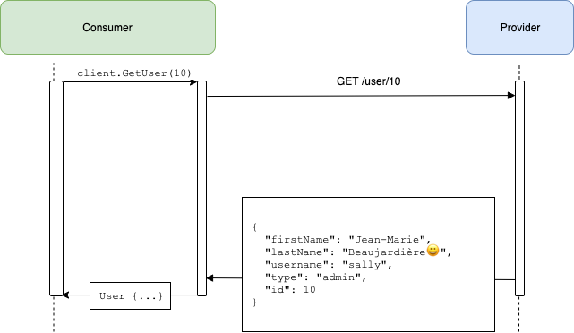

# Pact Go workshop

## Step 1 - Simple Consumer calling Provider

We need to first create an HTTP client to make the calls to our provider service:


_NOTE_: even if the API client had been been graciously provided for us by our Provider Team, it doesn't mean that we shouldn't write contract tests - because the version of the client we have may not always be in sync with the deployed API - and also because we will write tests on the output appropriate to our specific needs.

This User Service expects a `user` path parameter, and then returns some simple json back:



You can see the client public interface we created in the `consumer/client` package:

```go

type Client struct {
	BaseURL    *url.URL
	httpClient *http.Client
}

// GetUser gets a single user from the API
func (c *Client) GetUser(id int) (*model.User, error) {
}
```

We can run the client with `make run-consumer` - it should fail with an error, because the Provider is not running.

_Move on to [step 2](github.com/pact-foundation/pact-workshop-go/tree/master/steps/2)_
