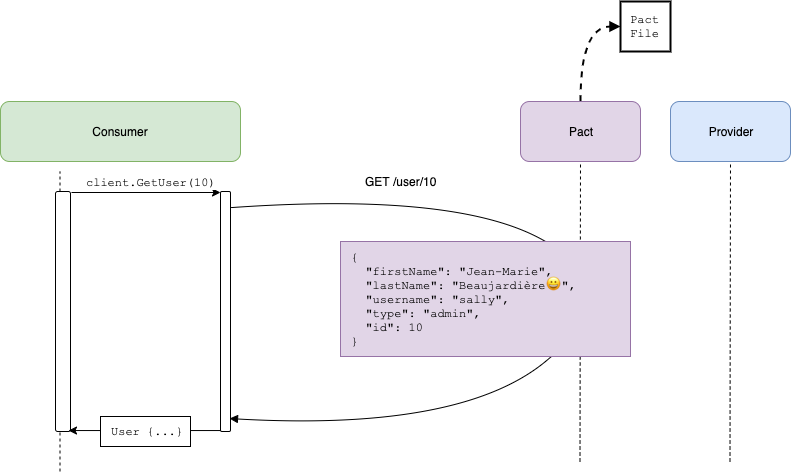

# Pact Go workshop

## Step 3 - Pact to the rescue

Let us add Pact to the project and write a consumer pact test for the `GET /users/:id` endpoint. Note how similar it looks to our unit test:

_consumer/client/client_pact_test.go:_

```go
	t.Run("the user exists", func(t *testing.T) {
		id := 10

		pact.
			AddInteraction().
			Given("User sally exists").
			UponReceiving("A request to login with user 'sally'").
			WithRequest(request{
				Method:  "GET",
				Path:    term("/users/10", "/user/[0-9]+"),
			}).
			WillRespondWith(dsl.Response{
				Status:  200,
				Body:    dsl.Match(model.User{}),
				Headers: commonHeaders,
			})

		err := pact.Verify(func() error {
			user, err := client.GetUser(id)

			// Assert basic fact
			if user.ID != id {
				return fmt.Errorf("wanted user with ID %d but got %d", id, user.ID)
			}

			return err
		})

		if err != nil {
			t.Fatalf("Error on Verify: %v", err)
		}
	})
```



This test starts a mock server a random port that acts as our provider service. To get this to work we update the URL in the `Client` that we create, after initialising Pact.

Running this test still passes, but it creates a pact file which we can use to validate our assumptions on the provider side, and have conversation around.

```console
$ make consumer
```

A pact file should have been generated in _pacts/goadminservice-gouserservice.json_

_Move on to [step 4](../4)_
