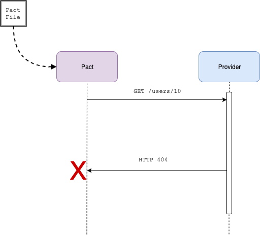

# Pact Go workshop

## Step 4 - Verify the provider



We now need to validate the pact generated by the consumer is valid, by executing it against the running service provider, which should fail:

```console
$ make provider

--- 🔨Running Provider Pact tests
go test -count=1 -tags=integration github.com/pact-foundation/pact-workshop-go/provider -run "TestPactProvider"
2019/10/30 11:29:49 API starting: port 62059 ([::]:62059)
--- FAIL: TestPactProvider (11.30s)
    pact.go:416: Verifying a pact between GoAdminService and GoUserService Given User sally exists A request to login with user 'sally' with GET /users/10 returns a response which has a matching body
        Actual: [{"firstName":"Jean-Marie","lastName":"de La Beaujardière😀😍","username":"sally","type":"admin","id":10}]

        Diff
        --------------------------------------
        Key: - is expected
             + is actual
        Matching keys and values are not shown

        -{
        -  "firstName": "Sally",
        -  "id": 10,
        -  "lastName": "McSmiley Face😀😍",
        -  "type": "admin",
        -  "username": "sally"
        -}
        +[
        +  {
        +    "firstName": "Jean-Marie",
        +    "lastName": "de La Beaujardière😀😍",
        +    "username": "sally",
        +    "type": "admin",
        +    "id": 10
        +  },
        +]


        Description of differences
        --------------------------------------
        * Expected a Hash (like {"firstName"=>"Sally", "id"=>10, "lastName"=>"McSmiley Face😀😍", "type"=>"admin", "username"=>"sally"}) but got an Array ([{"firstName"=>"Jean-Marie", "lastName"=>"de La Beaujardière😀😍", "username"=>"sally", "type"=>"admin", "id"=>10}]) at $

    user_service_test.go:43: error verifying provider: exit status 1
```

The test has failed, as the expected path `/users/:id` is actually triggering the `/users` endpoint (which we don't need), and returning a _list_ of Users instead of a _single_ User. We incorrectly believed our provider was following a RESTful design, but the authors were too lazy to implement a better routing solution 🤷🏻‍♂️.

*Move on to [step 5](../5)*