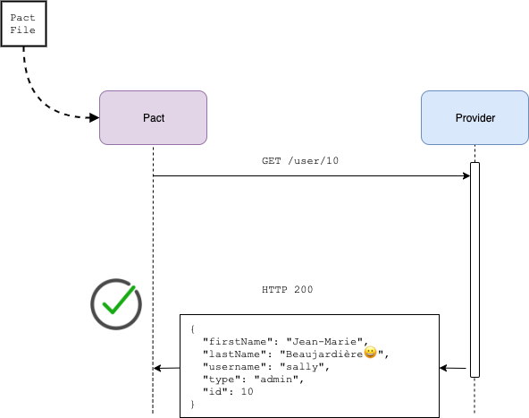

# Pact Go workshop

## Step 5 - Back to the client we go



Let's update the consumer test and client to hit the correct path, and run the provider verification also:

```
$ make consumer

--- 🔨Running Consumer Pact tests
go test github.com/pact-foundation/pact-workshop-go/consumer/client -run '^TestClientPact'
ok  	github.com/pact-foundation/pact-workshop-go/consumer/client	21.983s
```

```
$ make provider

--- 🔨Running Provider Pact tests
go test -count=1 -tags=integration github.com/pact-foundation/pact-workshop-go/provider -run "TestPactProvider"
ok  	github.com/pact-foundation/pact-workshop-go/provider	22.138s
```

Yay - green ✅!

*Move on to [step 6](../6)*